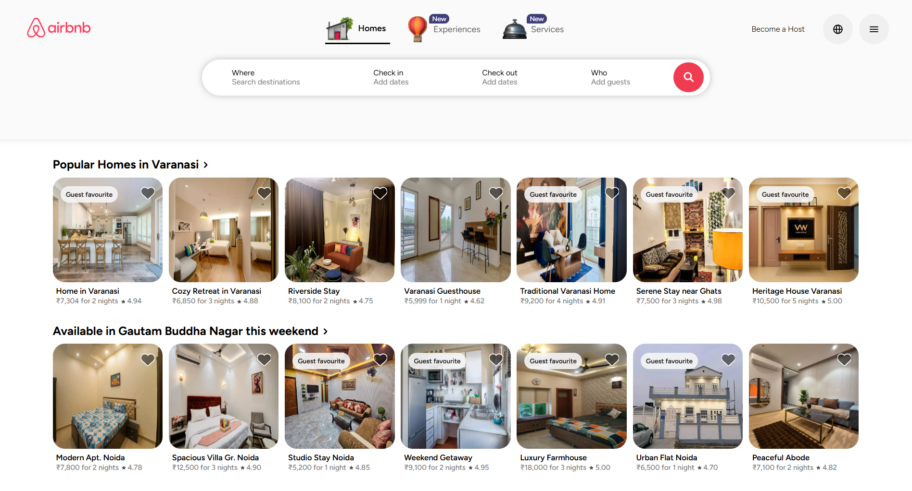
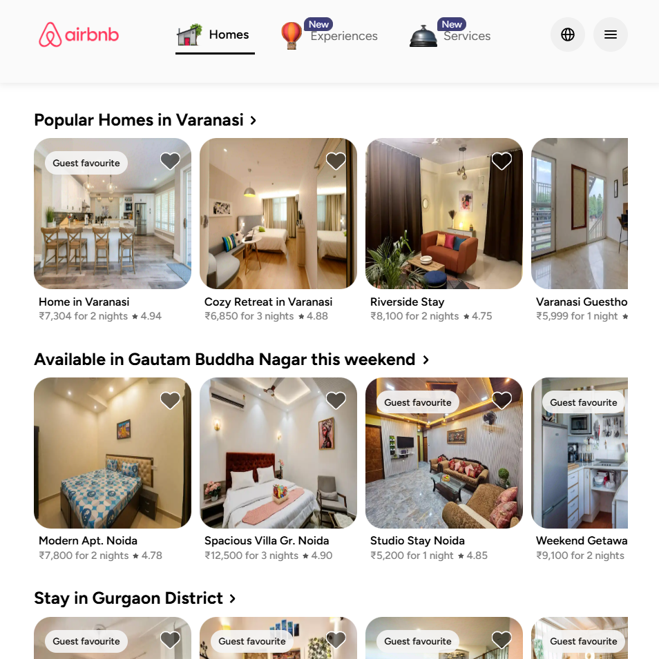
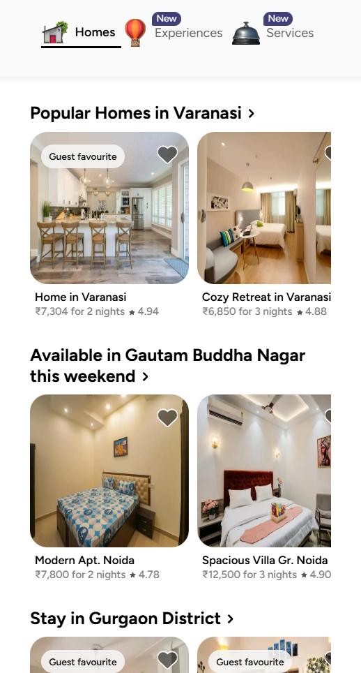

# 🏡 Airbnb UI Clone

A **fully responsive UI clone of Airbnb**, built using **pure HTML, CSS**, and few lines of **JavaScript** for smooth animations. This project focuses entirely on the **frontend design**, replicating Airbnb’s clean and modern layout — with **zero frameworks or libraries** involved. It runs seamlessly on all devices — **desktop, laptop, tablet, and mobile** — without any distortion.


---

# 🌐 Live Demo

🔗 **Live Website:** [https://krishnajain-dev.github.io/airbnb-ui-clone](https://krishnajain-dev.github.io/airbnb-ui-clone)
  

---

## 🛠️ Tech Stack

- **HTML5** – semantic structure  
- **CSS3** – custom styles, animations, responsive layout (Flexbox & Grid)  
- **JavaScript (Vanilla)** – minimal animations and interactivity  

---

## 📱 Responsive Design

Designed with **mobile-first** principles. Works perfectly on:

- 📱 Mobile  
- 💻 Laptop  
- 🖥️ Desktop  
- 📟 Tablet  

---

## 🖼 Preview

### Desktop View

<p align="center">
  
</p>

---

### Tablet View

<p align="center">
  
</p>

---

### Mobile View

<p align="center">
  
</p>


---

## ✨ Features

- ✅ Clean Airbnb-like UI
- ✅ 100% Responsive across all devices
- ✅ Lightweight and fast
- ✅ Animations using plain JavaScript
- ✅ No frameworks or libraries

---

## 🛠️ Getting Started

To run this project locally, follow these steps:

1. **Clone the repository to your local machine:**
   ```bash
   git clone https://github.com/Krishnajaindev/airbnb-ui-clone.git
    ```

2. **Navigate into the project directory:**

   ```bash
   cd airbnb
   ```

3. **Open the `index.html` file in your web browser.**

   * You can double-click the file, or
   * Right-click → "Open with" → choose your browser

---

## 📫 Connect With Me

* ✉️ [krishnajain2507@gmail.com](mailto:krishnajain.dev@gmail.com)
* 🔗 [LinkedIn](https://www.linkedin.com/in/krishnajaindev/)
* 💻 [GitHub](https://github.com/krishnajaindev)

---

## ⚡ License

This project is open source under the [MIT License](LICENSE).

---